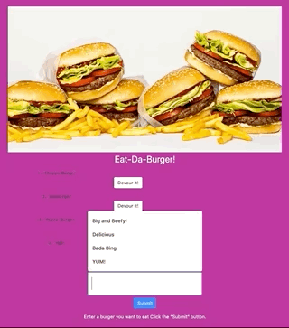

# Eat-Da-Burger
A restaurant app that lets users add new burgers to the menu, and then DEVOUR those burgers! Yum!

##### Heroku Deployment:
https://dry-tor-94811.herokuapp.com/

##### Install the application dependencies.

npm install

##### Finally, run the node server locally.

node server.js

##### Now, open the local application on port 8000 at the URL: http://localhost:8000/.

### Enjoy and have a burger!

